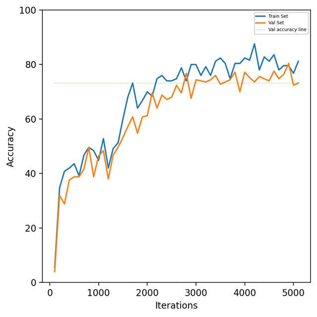
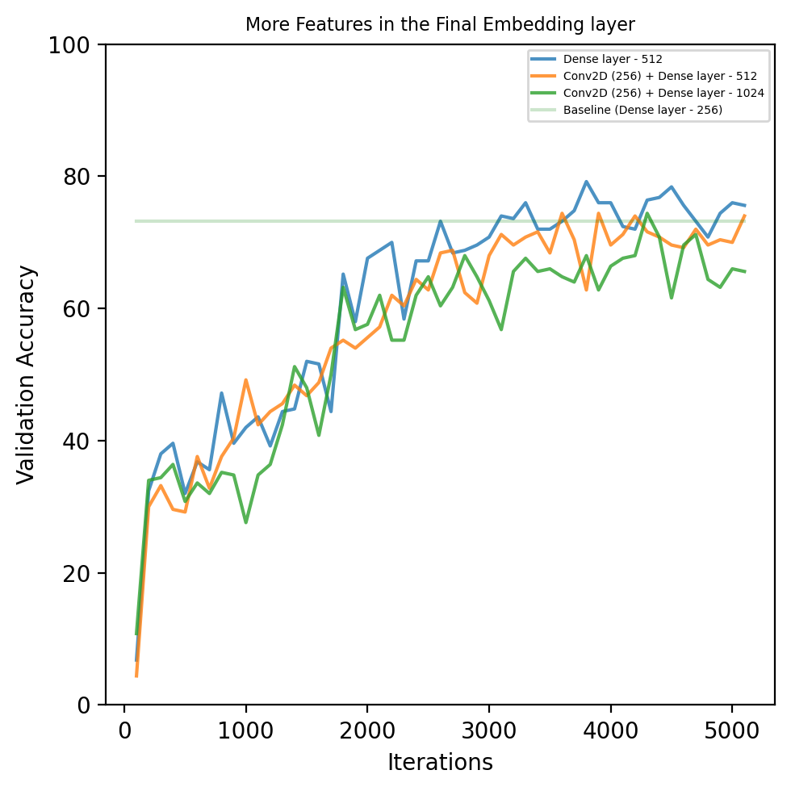
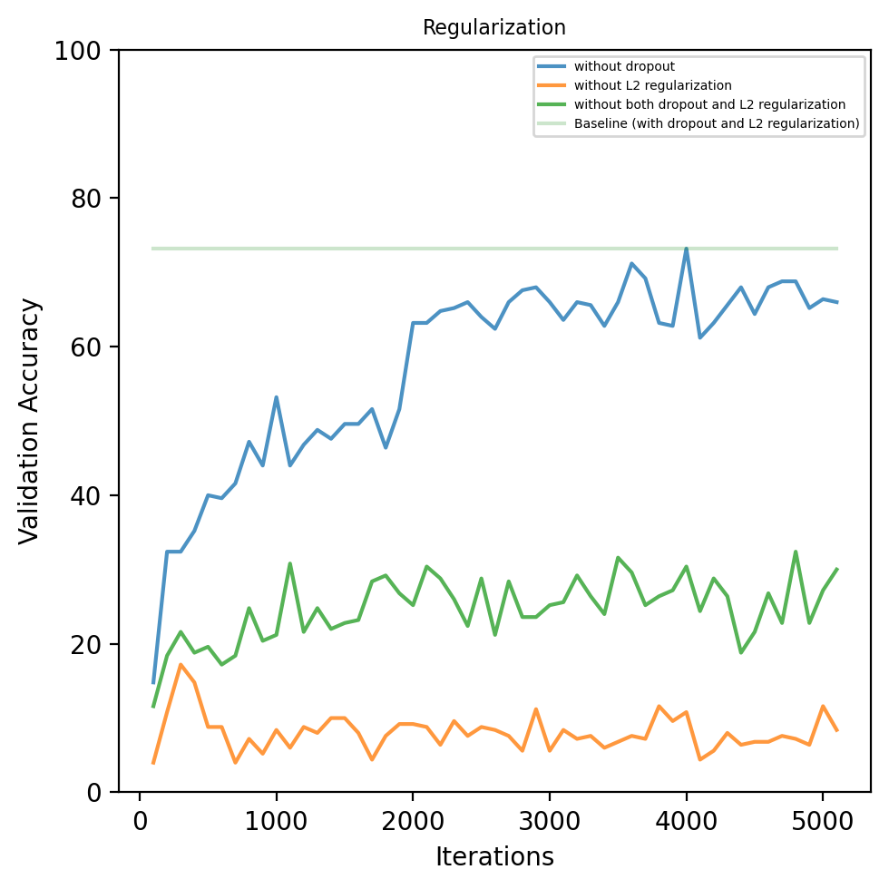
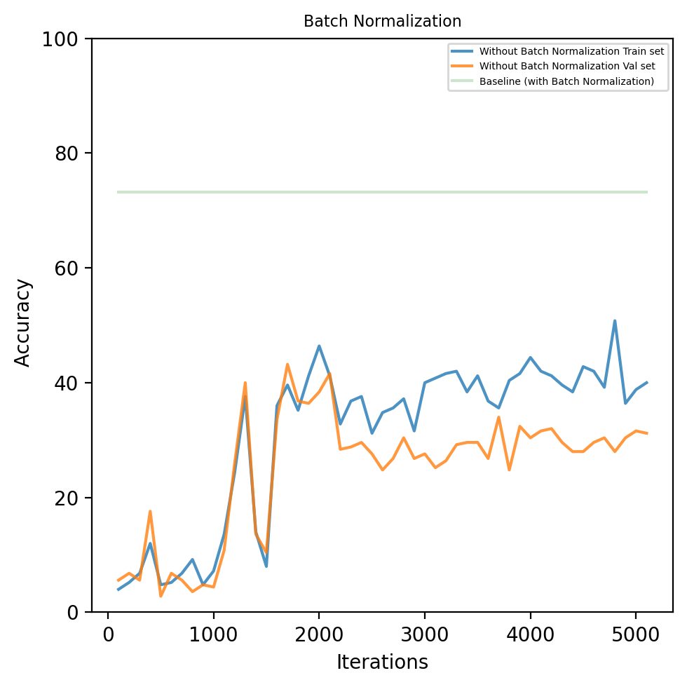
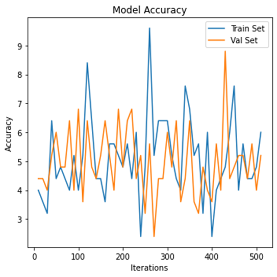

# Siamese Neural Networks: Exploring Architectures and Hyperparameters

## Abstract
This repository contains research on various architectures and hyperparameters for Siamese Neural Networks, focusing on their impact on model performance. The work was conducted as part of the **Recent Advances in Machine Learning** course at the **University of Siegen, SoSe 2022**.

The code is structured to train models using different configurations and to visualize their performance metrics. The dataset used is the **Omniglot dataset**, which can be downloaded [here](https://github.com/brendenlake/omniglot).

The code is inspired from the Kaggle notebook available [here](https://www.kaggle.com/code/kartik2112/omniglot-dataset-siamese-networks).

## Files in this Repository
- **`omniglot-dataset-siamese-networks.ipynb`**: Contains the code for training the model.
- **`plotting.ipynb`**: Contains the code for visualizing the metrics (training accuracy, validation accuracy, and training loss).

**Note**: The dataset is large and is not included in this repository. Please download it via the link provided above.

## Model Variations
The performance of multiple model variations is compared against a base model (`my_model_v3`). Each model explores a different architecture or hyperparameter configuration:

- **`my_model_v3`**: Baseline model.
- **`my_model_v4`**: Final dense layer of 128 units.
- **`my_model_v5`**: Final dense layer of 64 units.
- **`my_model_v6`**: Final dense layer of 512 units.
- **`my_model_v7`**: Conv2D with 256 filters + Final dense layer of 512 units.
- **`my_model_v8`**: Conv2D with 256 filters + Final dense layer of 1024 units.
- **`my_model_v9`**: Without dropout.
- **`my_model_v10`**: Without L2 regularization.
- **`my_model_v11`**: Without both dropout and L2 regularization.
- **`my_model_v12`**: Learning rate = 0.001.
- **`my_model_v13`**: Learning rate = 0.01.
- **`my_model_v14`**: Learning rate = 0.0001.
- **`my_model_v15`**: Zero weight initialization.
- **`my_model_v16`**: Architecture changed from CNN to MLP.
- **`my_model_v18`**: Without batch normalization.

## Validation Accuracy
Validation accuracy during training for all the model architectures is provided below.

### Baseline Model

    

### Final Embedding Layer
Comparison of models with fewer and more features:

    
    

### Regularization
Effect of regularization techniques on validation accuracy:

    

### Batch Normalization
Impact of batch normalization:

    

### Weight Initialization
Effect of different weight initialization strategies:

    

