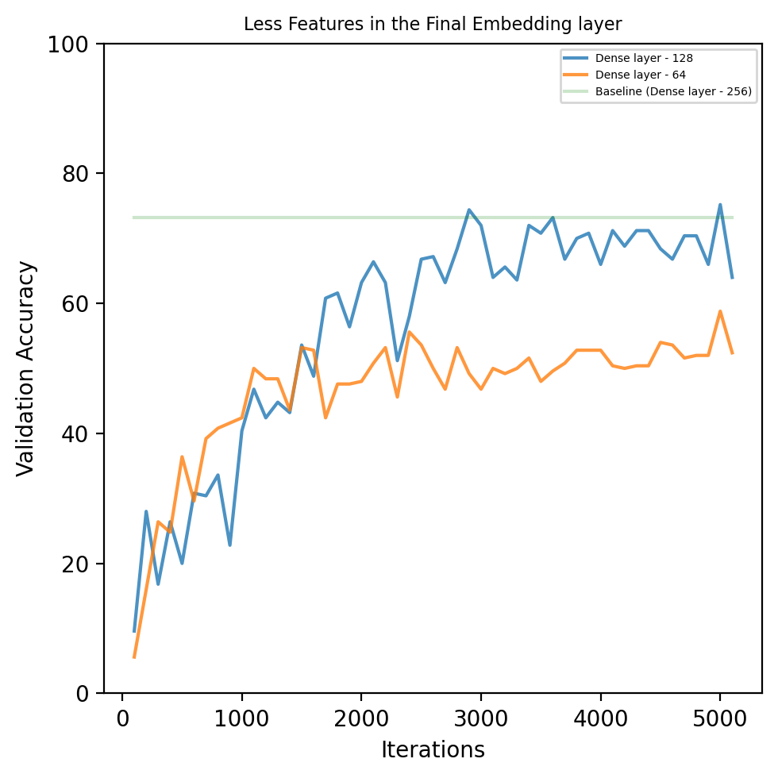

# Impact of Architectures and Hyperparameters on Neural Networks

## Abstract
This repository contains research on various architectures and hyperparameters for Neural Networks, focusing on their impact on model performance. The siamese neural network is used as an example. The work was conducted as part of the **Recent Advances in Machine Learning** course at the **University of Siegen, SoSe 2022**.

## Results

Table 1 presents the training and validation accuracy for various model architectures and hyperparameter configurations. The accuracy is measured for a 1-shot 20-way classification task on both the training and validation sets.

| Category             | Model Configuration                  | Train Accuracy (%) | Val Accuracy (%) |
|----------------------|--------------------------------------|--------------------|-------------------|
| **Baseline Model**   |                                      | 81.3               | 73.2              |
| **Final Embedding layer** | Dense - 128                          | 81.6               | 64                |
|                       | Dense - 64                           | 56                 | 52.4              |
|                       | Dense - 512                          | 80                 | 75.6              |
|                       | Conv2D (256) + Dense - 512           | 73.6               | 74                |
|                       | Conv2D (256) + Dense - 1024          | 73.2               | 65.6              |
| **Regularization**   | without Dropout                      | 74                 | 66                |
|                       | without L2 Regularization            | 8.4                | 8.4               |
|                       | without both methods                 | 26                 | 30                |
| **Learning rate**    | 0.0001                               | 92.4               | 76.8              |
|                       | 0.001                                | 59.6               | 47.2              |
|                       | 0.01                                 | 22.8               | 20.4              |
| **Weight Initialization** | Zero Initialization                  | 60                 | 50                |
| **Batch Normalization** | without Batch Normalization          | 40                 | 31.2              |
| **MLP**              | Dense (2048, 1024 and 512)           | 42                 | 34.4              |

The code is structured to train models using different configurations and to visualize their performance metrics. The dataset used is the **Omniglot dataset**, which can be downloaded [here](https://github.com/brendenlake/omniglot).

The code is inspired from the Kaggle notebook available [here](https://www.kaggle.com/code/kartik2112/omniglot-dataset-siamese-networks).

## Files in this Repository
- **`omniglot-dataset-siamese-networks.ipynb`**: Contains the code for training the model.
- **`plotting.ipynb`**: Contains the code for visualizing the metrics (training accuracy, validation accuracy, and training loss).

**Note**: The dataset is large and is not included in this repository. Please download it via the link provided above.

## Model Variations
The performance of multiple model variations is compared against a base model (`model_v3`). Each model explores a different architecture or hyperparameter configuration:

- **`model_v3`**: Baseline model.
- **`model_v4`**: Final dense layer of 128 units.
- **`model_v5`**: Final dense layer of 64 units.
- **`model_v6`**: Final dense layer of 512 units.
- **`model_v7`**: Conv2D with 256 filters + Final dense layer of 512 units.
- **`model_v8`**: Conv2D with 256 filters + Final dense layer of 1024 units.
- **`model_v9`**: Without dropout.
- **`model_v10`**: Without L2 regularization.
- **`model_v11`**: Without both dropout and L2 regularization.
- **`model_v12`**: Learning rate = 0.001.
- **`model_v13`**: Learning rate = 0.01.
- **`model_v14`**: Learning rate = 0.0001.
- **`model_v15`**: Zero weight initialization.
- **`model_v16`**: Architecture changed from CNN to MLP.
- **`model_v18`**: Without batch normalization.

## Validation Accuracy
Validation accuracy during training for all the model architectures is provided below.

### Baseline Model

    

### Final Embedding Layer
Comparison of models with fewer and more features:

    
    

### Regularization
Effect of regularization techniques on validation accuracy:

    

### Batch Normalization
Impact of batch normalization:

    

### Weight Initialization
Effect of different weight initialization strategies:

    

